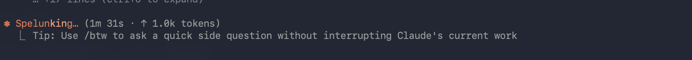
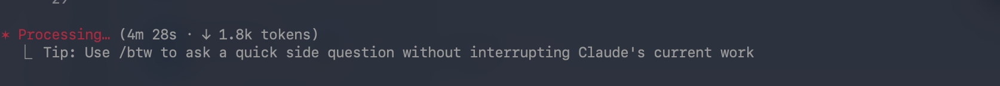
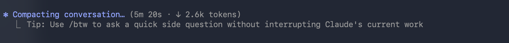

### GO应用程序内使用Claude Code工具状态展示

#### 需求背景

当在终端内使用`claude cli`工具时，最底部会实时更新并展示 当前执行的命令状态，token使用数，耗时，如果服务有问题还会展示retrying状态，如下面几个截图所示：






我想知道这个sdk`github.com/tea4go/claude-agent-sdk-go`能否能实现此功能？

#### 需求详情

GO应用程序内使用Claude Code工具需要尽量达到和在终端内使用`claude cli`工具时相同的状态展示。这个sdk已经fork，可以随意修改并发布。请分析可行性，并按照计划实现。

---

## 可行性分析

### 结论：**可行，大部分状态信息SDK已具备，少量需补充后完整实现。**

### 一、CLI状态栏展示的信息清单

根据Claude Code CLI底部状态栏，需要展示的核心信息：

| 状态信息 | CLI展示方式 | SDK当前支持情况 | 数据来源 |
|---------|-----------|--------------|---------|
| 当前活动（thinking/reading/writing/tool use） | 实时切换 | **StreamEvent + AssistantMessage** | `StreamEvent.Event["type"]` 区分 `content_block_start/delta/stop`，`ToolUseBlock.Name` 标识具体工具 |
| Token使用数（input/output） | 数字实时累加 | **已支持** | `AssistantMessage.Usage` (per-turn) + `ResultMessage.Usage` (total) |
| 缓存Token | 数字 | **已支持** | `Usage.CacheCreationInputTokens` / `Usage.CacheReadInputTokens` |
| 费用（USD） | $x.xxxx | **已支持** | `ResultMessage.TotalCostUSD` |
| 耗时 | Xm Xs | **已支持** | `ResultMessage.DurationMs` / `ResultMessage.DurationAPIMs` |
| Turn数 | 数字 | **已支持** | `ResultMessage.NumTurns` |
| Rate limit / retrying状态 | 红色警告 | **已支持** | `RateLimitEventMessage.IsAllowed()` + `AssistantMessage.IsRateLimited()` |
| 错误状态 | 错误信息 | **已支持** | `AssistantMessage.HasError()` / `ResultMessage.IsError` / `ResultMessage.Errors` |
| Stop reason | end_turn/tool_use等 | **已实现（本次新增）** | `AssistantMessage.StopReason` |
| 模型名称 | sonnet/opus等 | **已支持** | `AssistantMessage.Model` |
| 工具名称 | Read/Write/Bash等 | **已支持** | `ToolUseBlock.Name` |

### 二、实现架构

```
CLI Subprocess
    │
    ▼ stdout (JSON lines)
Parser
    │
    ▼ typed Messages
Consumer (你的Go应用)
    │
    ├─ AssistantMessage ──→ 累加 token、识别活动、检测 error
    ├─ StreamEvent ───────→ 实时活动状态（thinking/calling tool/writing）
    ├─ RateLimitEventMessage ──→ rate limit 状态
    ├─ ResultMessage ────→ 最终汇总（费用、耗时、总token）
    ├─ SystemMessage ────→ 阶段标识（init/result）
    └─ RawMessage ───────→ 未知类型的前向兼容处理
```

### 三、本次代码修改（已完成）

为了让SDK更完整地支持状态展示，完成了以下修改：

1. **新增 `Usage` 结构体** (`internal/shared/message.go`)
   - 类型化token使用数据，替代原来的 `map[string]any`
   - 字段：`InputTokens`, `OutputTokens`, `CacheCreationInputTokens`, `CacheReadInputTokens`

2. **新增 `AssistantMessage.Usage` 字段** (per-turn token usage, Python PR #685)
   - 每轮assistant消息携带token使用信息
   - `HasUsage()` / `GetStopReason()` / `IsToolUse()` 访问器方法

3. **新增 `AssistantMessage.StopReason` 字段**
   - `StopReasonEndTurn` / `StopReasonToolUse` / `StopReasonStopSequence` / `StopReasonMaxTokens` 常量

4. **`ResultMessage.Usage` 改为 `*Usage` 类型**
   - 从 `*map[string]any` 改为 `*Usage`，类型安全
   - 新增 `HasUsage()` 访问器

5. **新增 `RawMessage` 类型**
   - CLI输出未知类型时不再报错，而是保存为 `RawMessage`
   - 前向兼容：未来CLI新增消息类型不会导致SDK报错

6. **Parser更新** (`internal/parser/json.go`)
   - `parseUsage()` 辅助函数：从 `map[string]any` 提取到 `Usage` 结构体
   - `parseAssistantMessage()`: 新增 `usage` 和 `stop_reason` 解析
   - 默认分支：未知类型 → `RawMessage`（不再返回错误）

7. **Re-export** (`types.go`)
   - 导出 `Usage`, `RawMessage`, `StopReason*` 常量

8. **示例代码** (`examples/22_status_display/`)
   - 完整的状态展示demo，展示如何：
     - 实时追踪活动状态（thinking/calling tool/writing）
     - 累加token使用
     - 显示费用和耗时
     - 处理rate limit和error状态
     - 处理未知消息类型

### 四、与CLI状态栏的差距分析

| 能力 | 可行性 | 说明 |
|-----|-------|------|
| 实时活动状态 | **完全可行** | 通过StreamEvent的content_block_start/delta/stop可实现毫秒级更新 |
| Token计数 | **完全可行** | AssistantMessage.Usage(每轮) + ResultMessage.Usage(汇总) |
| 费用显示 | **完全可行** | ResultMessage.TotalCostUSD |
| 耗时显示 | **完全可行** | ResultMessage.DurationMs / DurationAPIMs |
| Rate limit检测 | **完全可行** | RateLimitEventMessage + AssistantMessage.IsRateLimited() |
| 错误展示 | **完全可行** | HasError/IsError/Errors字段 |
| 进度百分比 | **部分可行** | 无直接百分比数据，但可通过StreamStats.PendingTools估算工具进度 |
| 实时耗时（进行中） | **需自行实现** | SDK仅提供结束时的DurationMs；进行中的耗时需在应用层用time.Since()计时 |
| 实时费用（进行中） | **需估算** | SDK仅提供结束时的TotalCostUSD；进行中需基于已消耗token估算 |
| 响应速度/延迟 | **部分可行** | DurationAPIMs提供API侧耗时，但无逐轮实时延迟数据 |

### 五、建议

1. **使用 `Client` 流式API而非 `Query`**：Client模式持续接收消息，适合实时状态更新
2. **开启 `IncludePartialMessages`**：获取StreamEvent实现细粒度活动追踪
3. **应用层计时器**：用 `time.Since(startTime)` 显示实时耗时，不等ResultMessage
4. **费用估算**：根据已知模型的每token价格和已消耗token数实时估算费用
5. **关注 `RawMessage`**：未来CLI新增状态类型时，先通过RawMessage捕获，再升级SDK为类型化支持
